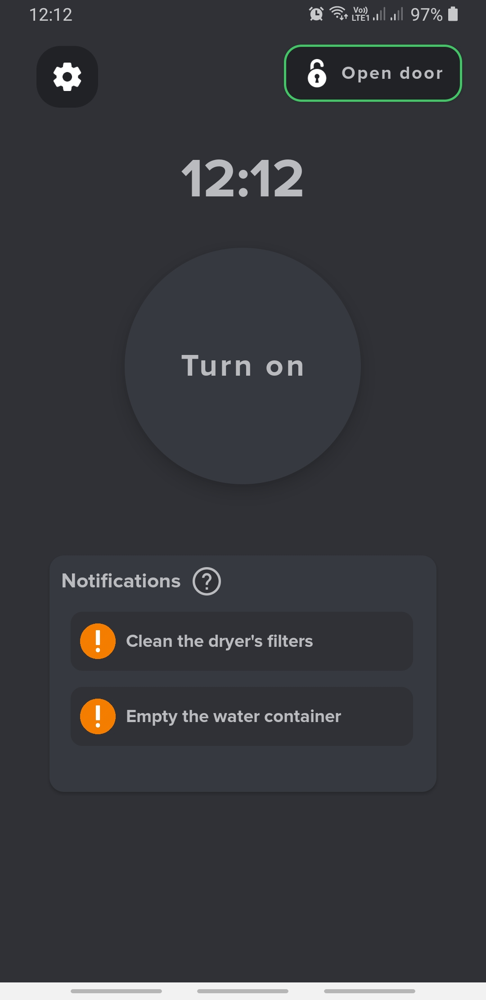
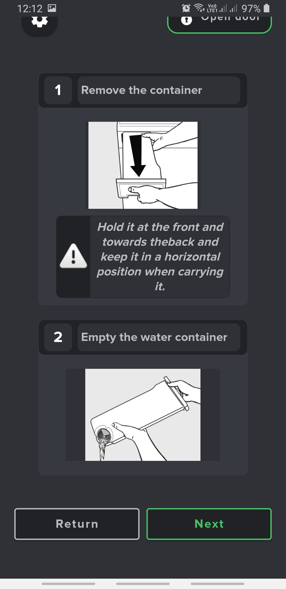
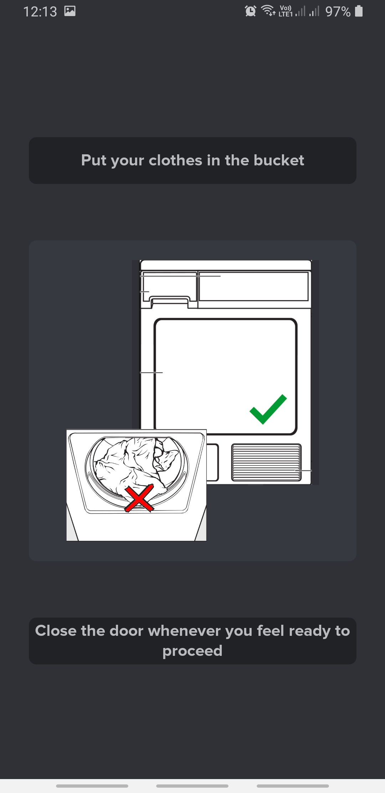
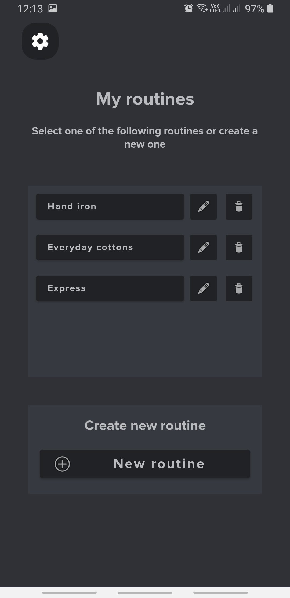
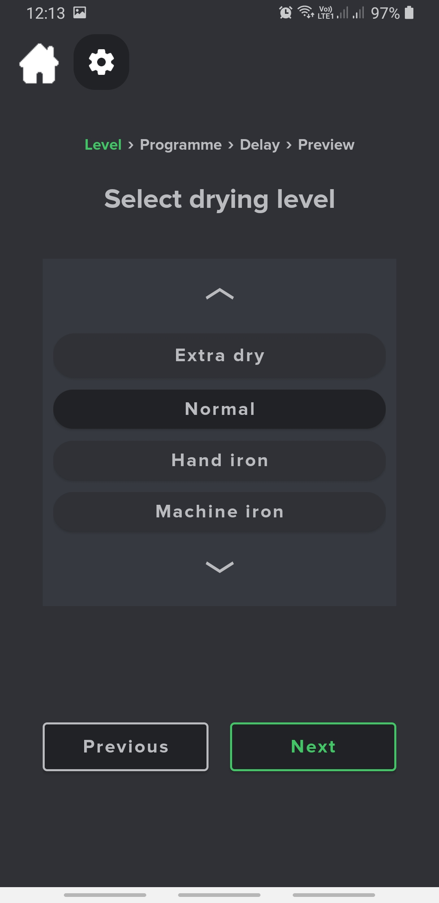
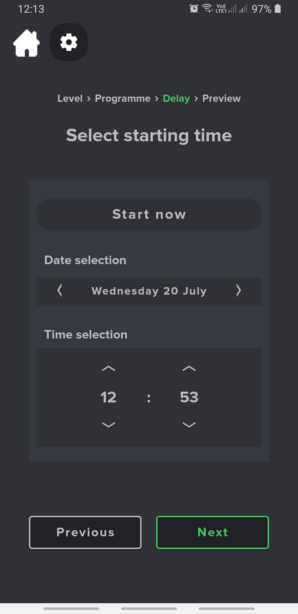
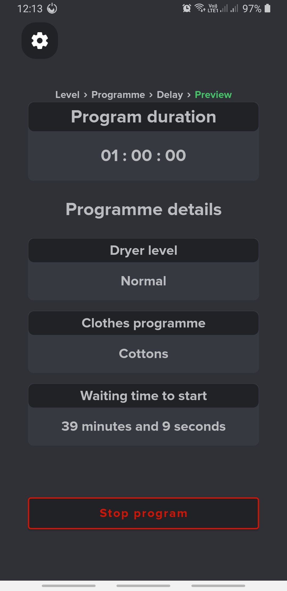

# Dryer UI

DryerUI is an android application which simplifies and beautifies the UI of an existing Miele home dryer. The goal of this university semester assignment is to teach good UI appearance principles and meticulous project design.

## Design model

The project was designed using a 4-stage repeating model. Each cycle was repeated 3 times and contained the following stages:

1. Analysis
2. Design
3. Production
4. Evaluation

Analysis aims at documenting the dryer's functions, abilities and constraints. For this reason, the machine's [manual](https://www.manualslib.com/manual/2251818/Miele-T-8861-Wp-Edition-111.html#manual) was used. In addition, during the analysis stage the core user demographic of the application had to be explored. User persons were made to achieve this goal.

Afterwards, the design stage lays the basic structure of the Android application. There is no actual coding in this stage, only theoritical design.

The production stage differs in each cycle. During first of three cycles, mock-ups were made using [Figma](https://www.figma.com). In the second cycle, a prototype of the application was made and tagged using Github's release feature. You can find the prototype [here](https://github.com/KonstantinosVasilopoulos/dryer_ui/releases/tag/v1.0.0). In the third and final cycle, the application was finalized and the end-product was released. The final product is based on the second cycle's prototype and can be found [here](https://github.com/KonstantinosVasilopoulos/dryer_ui/releases/tag/v1.0.1).

## Screenshots

Here is a list of screenshots of the application's activities.

Main activity

Container notification activity

After turning on the dryer, the user is prompted to close the machine's door in order to proceed

Activity for interacting stored routines

While creating a new routine, the user can select the routine's drying level in this activity

Similarly, the starting time of the routine can be selected here

Lastly, the preview activity is responsible for naming, initiating, pausing & stopping the routine.

## Features of the application

The application currently supports the following.

* Two languages: English, Greek
* Voice instructions: The application is blind-friendly and can notify the user about the actions it is performing via audible voice instructions. 
* Voice commands: The can also receive voice commands from the user.
* Notifications: Interactive notifications are also present. The user may start, pause and stop a selected routine using Android notifications.
